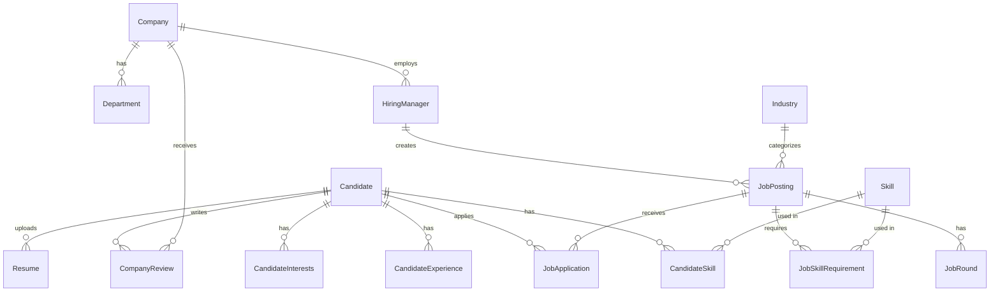

# Hirely

**A full-stack job platform where candidates find jobs, companies hire talent, and hiring managers manage the pipeline — all in one place.**

🔗 **Live:** [https://hireyou-opal.vercel.app](https://hireyou-opal.vercel.app)

---

## Table of Contents

- [Overview](#overview)
- [Tech Stack](#tech-stack)
- [Project Architecture](#project-architecture)
  - [Backend (Spring Boot)](#backend-spring-boot)
  - [Frontend (TanStack Start)](#frontend-tanstack-start)
- [Security Architecture](#security-architecture)
  - [Authentication Flow](#authentication-flow)
  - [Authorization Model](#authorization-model)
  - [CORS Policy](#cors-policy)
- [Database Schema](#database-schema)
- [API Overview](#api-overview)
- [Deployment Architecture](#deployment-architecture)
  - [Infrastructure Diagram](#infrastructure-diagram)
  - [Frontend — Vercel](#frontend--vercel)
  - [Backend — AWS EC2](#backend--aws-ec2)
  - [Database — PostgreSQL](#database--postgresql)
  - [systemd Service Management](#systemd-service-management)
- [Environment Variables](#environment-variables)
- [Local Development](#local-development)
- [License](#license)

---

## Overview

Hirely serves three distinct user types through a single unified platform:

| Role | Capabilities |
|------|-------------|
| **Candidate** | Browse jobs, apply with resume, track application status, manage profile & skills, write company reviews |
| **Company** | Create company profile, manage departments, post jobs, review applicants |
| **Hiring Manager** | Manage job postings, review applications, update application stages |

---

## Tech Stack

| Layer | Technology |
|-------|-----------|
| **Frontend** | React 19, TanStack Start (SSR), TanStack Router, TanStack Query, Tailwind CSS v4, Radix UI, Vite 8 |
| **Backend** | Java 17, Spring Boot 3.5, Spring Security, Spring Data JPA, MapStruct, Lombok |
| **Database** | PostgreSQL (with Hibernate ORM, `ddl-auto: update`) |
| **Auth** | JWT (JJWT 0.12.6), BCrypt password hashing, stateless sessions |
| **Email** | Spring Mail (Gmail SMTP), async with dedicated thread pool |
| **File Handling** | Apache Tika for MIME validation, local filesystem storage |
| **API Docs** | SpringDoc OpenAPI (Swagger UI) |
| **Deployment** | Vercel (frontend), AWS EC2 (backend), systemd process management |

---

## Project Architecture

```
Hirely/
├── Frontend/                    # TanStack Start SSR app (React 19 + Vite)
│   ├── src/
│   │   ├── components/
│   │   │   ├── site/            # App-specific components (Header, Footer, AuthForm, SearchBar, etc.)
│   │   │   └── ui/              # Reusable UI primitives (46 shadcn/ui components)
│   │   ├── hooks/               # Custom React hooks
│   │   ├── lib/
│   │   │   ├── api.ts           # Centralized API client (fetch wrapper with JWT injection)
│   │   │   ├── role.tsx         # Auth state management (React Context + localStorage)
│   │   │   └── theme.tsx        # Dark/light theme provider
│   │   ├── routes/              # File-based routing (TanStack Router)
│   │   ├── types/               # Shared TypeScript interfaces
│   │   ├── router.tsx           # Router factory with QueryClient
│   │   ├── server.ts            # SSR entry point with error boundary
│   │   └── start.ts             # CSRF middleware + error middleware
│   ├── vite.config.ts           # Lovable TanStack config (Nitro + Vercel preset)
│   └── package.json
│
├── src/main/java/com/sai/hirely/
│   ├── apis/                    # REST Controllers
│   │   ├── login/               # Auth endpoints (Candidate, Company, HiringManager)
│   │   ├── candidate/           # Candidate profile, skills, experience
│   │   ├── company/             # Company, departments, reviews, hiring managers
│   │   ├── job/                 # Job postings, applications
│   │   └── resumes/             # File upload (resume, images)
│   ├── config/                  # Spring configuration
│   │   ├── SecurityBeanConfig   # Auth providers + password encoder
│   │   └── AsyncConfig          # Thread pool for async email dispatch
│   ├── dto/                     # Data Transfer Objects (request/response)
│   ├── exceptions/              # Custom exceptions + GlobalExceptionHandler
│   ├── mappers/                 # MapStruct entity-DTO mappers
│   ├── models/                  # JPA Entities
│   │   ├── candidate/           # Candidate, CandidateSkill, CandidateExperience, CandidateInterests
│   │   ├── company/             # Company, Department, HiringManager, CompanyReview
│   │   ├── job/                 # JobPosting, JobApplication, JobSkillRequirement, JobRound, Industry
│   │   ├── enums/               # ApplicationStatus, Gender, PostingStatus, Proficiency
│   │   └── utils/               # Skill, RoleEntity, Resume, Location, WorkMode, JobType
│   ├── repository/              # Spring Data JPA repositories
│   ├── security/                # JWT + Spring Security
│   │   ├── SecurityConfig       # Filter chain, CORS, endpoint authorization rules
│   │   ├── JwtFilter            # OncePerRequestFilter — extracts & validates Bearer tokens
│   │   ├── JwtService           # Token generation, validation, claim extraction
│   │   ├── CurrentUser          # Utility for role/ownership enforcement in controllers
│   │   └── details/             # Multi-type UserDetailsService (Factory pattern)
│   └── service/                 # Business logic layer
│       ├── candidate/           # Candidate, skill, experience services
│       ├── company/             # Company, department services
│       ├── job/                 # Job posting, application services
│       ├── email/               # Async email service
│       ├── storage/             # File storage service
│       ├── skill/               # Skill catalog service
│       ├── role/                # Role service
│       └── valid/               # Validation service
│
├── src/main/resources/
│   ├── application.yaml         # Dev configuration
│   └── application-prod.yaml    # Production configuration (env var references)
│
└── pom.xml                      # Maven build (Spring Boot 3.5.5, Java 17)
```

### Backend (Spring Boot)

The backend follows a **layered architecture**:

```
Controller (apis/) → Service (service/) → Repository (repository/) → Database
     ↕                    ↕
   DTO (dto/)         Entity (models/)
     ↕
  Mapper (mappers/)
```

- **Controllers** handle HTTP requests, delegate to services, and return DTOs.
- **Services** contain all business logic, transaction management, and cross-cutting concerns.
- **Repositories** extend Spring Data JPA interfaces for database access.
- **MapStruct Mappers** handle bidirectional entity-DTO conversion at compile time (zero-reflection).
- **GlobalExceptionHandler** provides uniform error responses across all endpoints.

### Frontend (TanStack Start)

The frontend is a **server-side rendered (SSR)** React application:

- **TanStack Router** provides file-based routing with type-safe navigation.
- **TanStack Query** manages all server state (caching, refetching, optimistic updates).
- **Centralized API client** (`lib/api.ts`) wraps `fetch` with automatic JWT injection, 401 auto-logout, and structured error parsing.
- **Role Context** (`lib/role.tsx`) manages authentication state via `localStorage` with JWT expiry checking.
- **Theme Provider** (`lib/theme.tsx`) supports light/dark/system themes with a flash-free init script injected before first paint.

---

## Security Architecture

### Authentication Flow

```
┌──────────┐     POST /login/{type}      ┌─────────────┐
│  Client   │ ──────────────────────────→ │  Login API   │
│ (Browser) │     { email, password }     │  Controller  │
└──────────┘                              └──────┬──────┘
                                                 │
                                    ┌────────────▼───────────┐
                                    │ DaoAuthenticationProvider│
                                    │  (per account type)     │
                                    └────────────┬───────────┘
                                                 │
                                    ┌────────────▼───────────┐
                                    │ UserDetailsServiceFactory│
                                    │  ├─ CandidateDetails    │
                                    │  ├─ CompanyDetails      │
                                    │  └─ HiringMgrDetails    │
                                    └────────────┬───────────┘
                                                 │
                                    ┌────────────▼───────────┐
                                    │    BCrypt Verification   │
                                    └────────────┬───────────┘
                                                 │ (match)
                                    ┌────────────▼───────────┐
                                    │     JwtService          │
                                    │  generateToken(user)    │
                                    │  Claims: roles, type,   │
                                    │          userId, sub,    │
                                    │          exp (24h)       │
                                    └────────────┬───────────┘
                                                 │
┌──────────┐     { token, username }     ┌──────▼──────┐
│  Client   │ ←───────────────────────── │   Response   │
│ (Browser) │   stored in localStorage   └─────────────┘
└──────────┘
```

**Key security decisions:**

| Aspect | Implementation |
|--------|---------------|
| **Password hashing** | BCrypt (via `BCryptPasswordEncoder`) |
| **Token format** | JWT signed with HMAC-SHA (Base64-encoded secret, min 256 bits) |
| **Token lifetime** | 24 hours (`86400000` ms) |
| **Session management** | Fully **stateless** (`SessionCreationPolicy.STATELESS`) |
| **CSRF** | Disabled on backend (stateless JWT); CSRF middleware on frontend SSR server functions |
| **Multi-tenant auth** | Factory pattern — `UserDetailsServiceFactory` routes to the correct `UserDetailsService` based on `AccountType` claim in JWT |

### Authorization Model

Every incoming request passes through the **`JwtFilter`** (a `OncePerRequestFilter`) which:

1. Extracts the `Bearer` token from the `Authorization` header.
2. Decodes the `sub` (email) and `type` (account type) claims.
3. Loads the correct `UserDetails` via the `UserDetailsServiceFactory`.
4. Validates the token signature and expiry.
5. Sets the `SecurityContext` authentication.

Endpoint-level authorization is enforced in `SecurityConfig`:

| Endpoint Pattern | Access |
|-----------------|--------|
| `/login/**`, `/signup/**` | Public |
| `/actuator/**` | Public |
| `GET /api/catalog/**`, `/api/skills` | Public |
| `GET /api/companies`, `/api/companies/*` | Public |
| `GET /api/post-job/filter`, `/api/post-job/*` | Public |
| `/api/candidates/**`, `/api/apply/**` | `ROLE_CANDIDATE` only |
| `/api/companies/me/**` | `ROLE_COMPANY` only |
| `/api/applications/job/**` | `ROLE_HIRING_MANAGER` or `ROLE_COMPANY` |
| Everything else | Authenticated |

**Controller-level enforcement** is additionally done via `CurrentUser.require()` which checks `AccountType` and `CurrentUser.requireId()` which ensures users can only modify their own resources.

### CORS Policy

- Allowed origins read from `app.cors.allowed-origin` (supports comma-separated patterns).
- Allowed methods: `GET`, `POST`, `PUT`, `PATCH`, `DELETE`, `OPTIONS`.
- Credentials: **enabled** (for `Authorization` header).
- Pre-flight cache: 1 hour (`maxAge: 3600`).
- Production origin: `https://hireyou-opal.vercel.app`.

---

## Database Schema



**Key entities:**

| Entity | Description |
|--------|------------|
| `Candidate` | Job seeker profile with personal info, location, skills, experience |
| `Company` | Employer profile with slug, industry, departments |
| `HiringManager` | Company employee who can post jobs and review applications |
| `JobPosting` | Job listing with title, salary range, work mode, status, skill requirements |
| `JobApplication` | Links candidate to job with status tracking (`APPLIED` → `SCREENING` → `INTERVIEW` → `OFFER` / `REJECTED`) |
| `CompanyReview` | Candidate-written reviews with star rating |
| `Skill` | Shared skill catalog used by both candidates and job requirements |
| `Resume` | Uploaded file metadata (stored on server filesystem) |

---

## API Overview

### Authentication
| Method | Endpoint | Description |
|--------|----------|-------------|
| `POST` | `/login/candidate` | Candidate login → JWT |
| `POST` | `/signup/candidate` | Candidate registration → JWT |
| `POST` | `/login/company` | Company login → JWT |
| `POST` | `/signup/company` | Company registration → JWT |
| `POST` | `/login/hiring-manager` | Hiring manager login → JWT |
| `POST` | `/signup/hiring-manager` | Hiring manager registration → JWT |

### Candidate
| Method | Endpoint | Description |
|--------|----------|-------------|
| `GET` | `/api/candidates/me` | Get current candidate profile |
| `PUT` | `/api/candidates/me` | Update profile |
| `GET/POST/DELETE` | `/api/candidate-skills/**` | Manage skills |
| `GET/POST/PUT/DELETE` | `/api/candidate-experiences/**` | Manage experience entries |

### Company
| Method | Endpoint | Description |
|--------|----------|-------------|
| `GET` | `/api/companies` | List all companies (public) |
| `GET` | `/api/companies/{slug}` | Company detail by slug (public) |
| `PUT` | `/api/companies/me` | Update own company profile |
| `GET/POST` | `/api/company-reviews/**` | Company reviews |
| `GET/POST/DELETE` | `/api/hiring-managers/**` | Manage hiring managers |

### Jobs
| Method | Endpoint | Description |
|--------|----------|-------------|
| `GET` | `/api/post-job/filter` | Search/filter jobs (public) |
| `POST` | `/api/post-job/filter` | Advanced job filtering (public) |
| `GET` | `/api/post-job/{id}` | Job detail (public) |
| `POST` | `/api/post-job` | Create job posting |
| `POST` | `/api/apply/{jobId}` | Apply for a job |
| `GET` | `/api/applications/me` | Candidate's applications |
| `GET` | `/api/applications/job/{id}` | Applicants for a job (company/hiring manager) |

### Files
| Method | Endpoint | Description |
|--------|----------|-------------|
| `POST` | `/api/files/upload/resume` | Upload resume (PDF/DOCX, max 10MB) |
| `POST` | `/api/files/upload/image` | Upload profile image (PNG/JPEG/WebP, max 1MB) |

---

## Deployment Architecture

### Infrastructure Diagram

```
┌─────────────────────────────────────────────────────────────────────┐
│                           INTERNET                                  │
└───────────────┬───────────────────────────────────┬─────────────────┘
                │                                   │
    ┌───────────▼───────────┐           ┌───────────▼───────────┐
    │       Vercel           │           │      AWS EC2           │
    │   (Frontend SSR)       │           │   (eu-north-1)         │
    │                        │           │                        │
    │  ┌──────────────────┐  │   HTTPS   │  ┌──────────────────┐  │
    │  │ Nitro Serverless  │  │ ────────→ │  │ Spring Boot App  │  │
    │  │ Function          │  │  API      │  │ (port 8080)      │  │
    │  │                   │  │  calls    │  │                   │  │
    │  │ • SSR rendering   │  │           │  │ • REST API        │  │
    │  │ • Static assets   │  │           │  │ • JWT Auth        │  │
    │  │ • CSRF protection │  │           │  │ • File storage    │  │
    │  └──────────────────┘  │           │  │ • Email dispatch   │  │
    │                        │           │  └────────┬─────────┘  │
    │  Static CDN:           │           │           │            │
    │  • JS bundles          │           │  ┌────────▼─────────┐  │
    │  • CSS                 │           │  │   PostgreSQL      │  │
    │  • favicon             │           │  │  (localhost:5432) │  │
    │                        │           │  │   hirely_db       │  │
    └────────────────────────┘           │  └──────────────────┘  │
                                         │                        │
                                         │  /opt/myapp/           │
                                         │  ├── app.jar           │
                                         │  └── uploads/          │
                                         │      ├── resumes/      │
                                         │      └── images/       │
                                         └────────────────────────┘
```

### Frontend — Vercel

The frontend is deployed as a **TanStack Start SSR application** on Vercel using the Nitro `vercel` preset.

**Build process:**
1. Vercel clones the repository.
2. **Root Directory** is set to `Frontend`.
3. **Framework Preset** is set to `Other` (not "Vite" — critical for SSR to work).
4. `npm run build` runs → Nitro detects the Vercel environment → outputs to `.vercel/output/`.
5. Vercel picks up both the **static assets** (`.vercel/output/static/`) and the **Serverless Function** (`.vercel/output/functions/__server.func/`).
6. The Serverless Function handles all route requests with SSR, preventing 404s on page reload.

**Environment variable:**
| Key | Purpose |
|-----|---------|
| `VITE_API_URL` | Backend API base URL (injected at build time) |

### Backend — AWS EC2

The Spring Boot backend runs on an **AWS EC2 instance** in `eu-north-1` (Stockholm).

| Configuration | Value |
|--------------|-------|
| Instance type | t3.micro (or similar) |
| OS | Amazon Linux 2 |
| Java | OpenJDK 17 |
| App location | `/opt/myapp/app.jar` |
| Upload storage | `/opt/myapp/uploads/` |
| Spring profile | `prod` |
| Server port | `8080` |
| JVM flags | `-Xmx400m -Xms256m` |

### Database — PostgreSQL

PostgreSQL runs **locally on the same EC2 instance** (not exposed externally).

| Configuration | Value |
|--------------|-------|
| Host | `localhost` |
| Port | `5432` |
| Database | `hirely_db` |
| User | `hirely_user` |
| Connection pool | HikariCP (min 5, max 10) |
| Schema management | Hibernate `ddl-auto: update` |

**Health check:**
```bash
pg_isready -h localhost -p 5432
# → localhost:5432 - accepting connections
```

### systemd Service Management

The application runs as a **systemd service** for automatic restart and boot persistence:

```ini
# /etc/systemd/system/hirely.service
[Unit]
Description=Hirely Spring Boot Application
After=network.target postgresql.service

[Service]
User=ec2-user
WorkingDirectory=/opt/myapp
ExecStart=/usr/bin/java -Xmx400m -Xms256m -jar /opt/myapp/app.jar --spring.profiles.active=prod
Restart=on-failure
RestartSec=10

Environment=SPRING_DATASOURCE_URL=jdbc:postgresql://localhost:5432/hirely_db
Environment=SPRING_DATASOURCE_USERNAME=<db_user>
Environment=SPRING_DATASOURCE_PASSWORD=<db_password>
Environment=MAIL_USERNAME=<gmail_address>
Environment=MAIL_PASSWORD=<gmail_app_password>
Environment=JWT_SECRET_BASE64=<base64_secret>
Environment=CORS_ALLOWED_ORIGIN=https://hireyou-opal.vercel.app
Environment=FRONTEND_URL=https://hireyou-opal.vercel.app

[Install]
WantedBy=multi-user.target
```

**Common operations:**
```bash
# Start / stop / restart
sudo systemctl start hirely
sudo systemctl stop hirely
sudo systemctl restart hirely

# Check status
sudo systemctl status hirely

# View logs
journalctl -u hirely -f

# Health check
curl http://localhost:8080/actuator/health
# → {"status":"UP"}
```

---

## Environment Variables

### Backend (`application-prod.yaml` — resolved from systemd environment)

| Variable | Description |
|----------|------------|
| `SPRING_DATASOURCE_URL` | JDBC URL for PostgreSQL |
| `SPRING_DATASOURCE_USERNAME` | Database username |
| `SPRING_DATASOURCE_PASSWORD` | Database password |
| `MAIL_USERNAME` | Gmail address for sending emails |
| `MAIL_PASSWORD` | Gmail app-specific password |
| `JWT_SECRET_BASE64` | Base64-encoded HMAC signing key (min 256 bits) |
| `CORS_ALLOWED_ORIGIN` | Allowed frontend origin (e.g., `https://hireyou-opal.vercel.app`) |
| `FRONTEND_URL` | Frontend base URL (used in email links) |

### Frontend (Vercel environment variables)

| Variable | Description |
|----------|------------|
| `VITE_API_URL` | Backend API base URL (e.g., `http://<ec2-ip>:8080`) |

---

## Local Development

### Prerequisites

- Java 17+
- Maven 3.8+
- Node.js 18+ (or Bun)
- PostgreSQL 14+

### Backend

```bash
# From project root
./mvnw spring-boot:run
# Starts on http://localhost:8081 (dev profile)
```

### Frontend

```bash
cd Frontend
npm install
npm run dev
# Starts on http://localhost:5173 (proxies API to localhost:8081)
```

### Database (local dev)

The dev profile (`application.yaml`) connects to:
- Host: `localhost:5432`
- Database: `hirely`
- Username: `user` / Password: `password`

Create the database:
```bash
createdb hirely
# Or seed with provided data:
psql -d hirely -f seed.sql
```

---

## License

This project is for educational and portfolio purposes.
